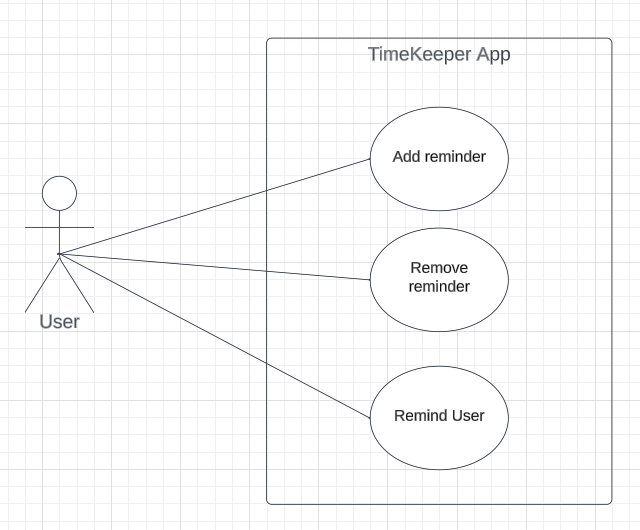
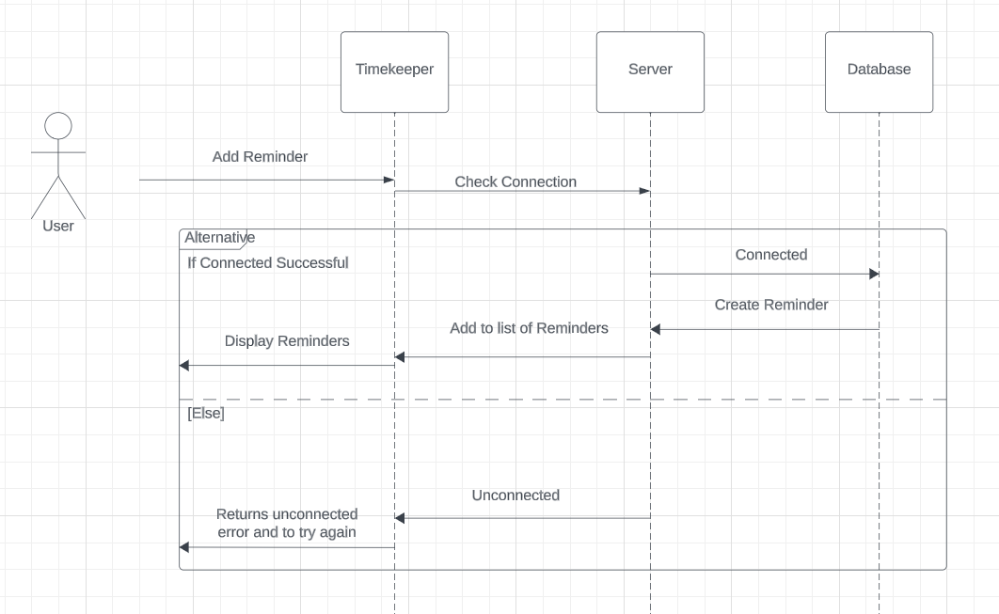
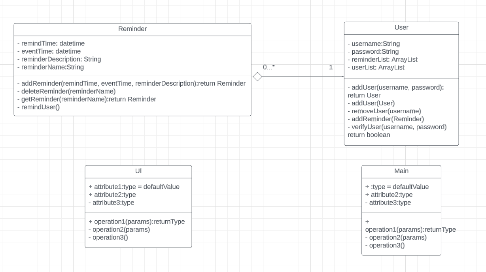

# TimeKeeper

## 1. Abstraction

 People today are constantly busy and on the move and sometimes, It can be diffuclt to remember everything that needs to be done. Our app, TimeKeeper, is designed to help keep you organized throughout your day. With the app you can set reminders and choose when it should remind you about your various tasks.

## Developed By

**Felix Miner** \
**Justin Ott**, \
**Evan Maurer**

## 2. Introduction

Making sure you are staying productive is important, With almost everyone having a smart phone, we have made aquick and easy way to get thoughts of important events out of head, and saved into your device. These reminders can be as simple or important as you want them to be, from a reminder to preheat the oven to an important interview. With TimeKeeper, you will be able to do just that. Quick and easy reminders and the touch of a button, with flexible options for the reminders

## 3. Architecture

### 3.1 UML

#### 3.1.1 Use Case Diagram

#### 3.1.2 Sequence Diagram

#### 3.1.3 Class Diagram

