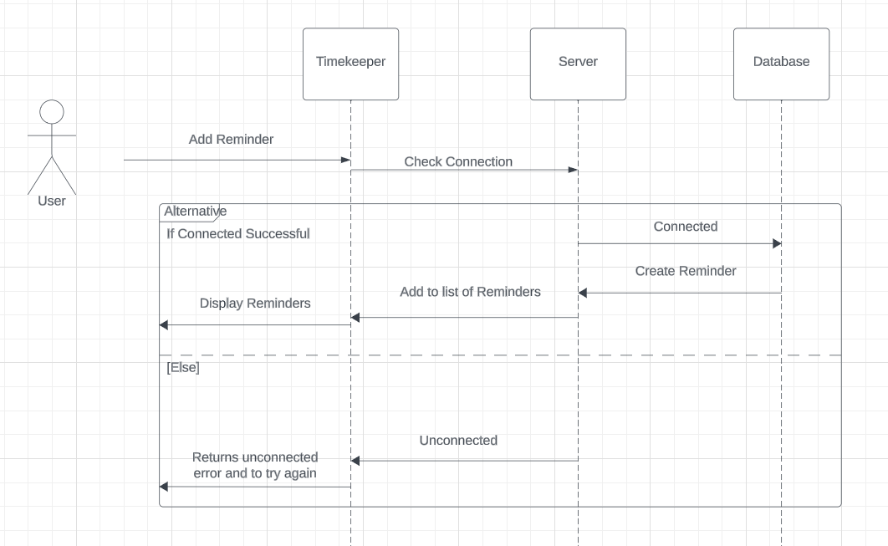
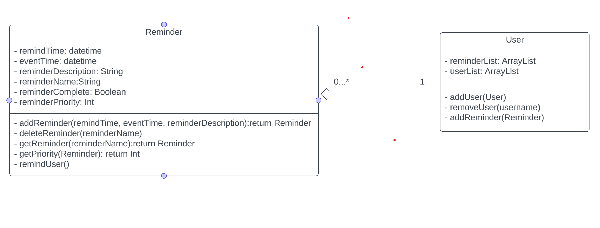

# TimeKeeper

## 1. Abstraction

People today are constantly busy and on the move and sometimes, it can be diffuclt to remember everything that needs to be done. Our web application, "**TimeKeeper**", is designed to help keep you organized throughout your day. Through the user-friendly interface, you are able to create reminders, prioritize them, and get reminded at any time you set.  "**TimeKeeper**" is designed to help users manage their time more effectively, reducing the likelihood of forgetting important tasks and ensuring that all tasks are completed in a timely manner.

## Developed By

**Felix Miner** \
**Justin Ott** \
**Evan Maurer**

## 2. Introduction

Javascript is a popular programming language for web development that through the use of React allows us to create a user-friendly interface.  With the busy pace of modern life making sure you are staying productive is important, with almost everyone having access to the web, we have made a quick and easy way to get thoughts of important events out of head, and saved into your device. These reminders can be as simple or important as you want them to be, from a reminder to preheat the oven to an important interview. With  "**TimeKeeper**", you will be able to do just that. Quick and easy reminders and the touch of a button, with flexible options for the reminders.

## 3. Architecture

"**TimeKeeper**" web application is based on the client-server architecture.  The client is provided with an interactive web app user interface for the process of creating reminders and getting reminded.  The server-side processing will be enabled using Mern.  The client requests the user's previous reminders and the server responds with all the reminders the user had input the last time they used "**TimeKeeper**."

### 3.1 UML

#### 3.1.1 Use Case Diagram

#### 3.1.2 Sequence Diagram

Figure 2 shows the sequence diagram for the add reminder usecase.  Initially the user interface is loaded and the app will check if it is connected to the server.  If it is connected the app will connect to the database and create the reminder and add it to the list of reminders.  If the app isn't connected to the server a unconnected error is displayed to the user.

#### 3.1.3 Class Diagram

